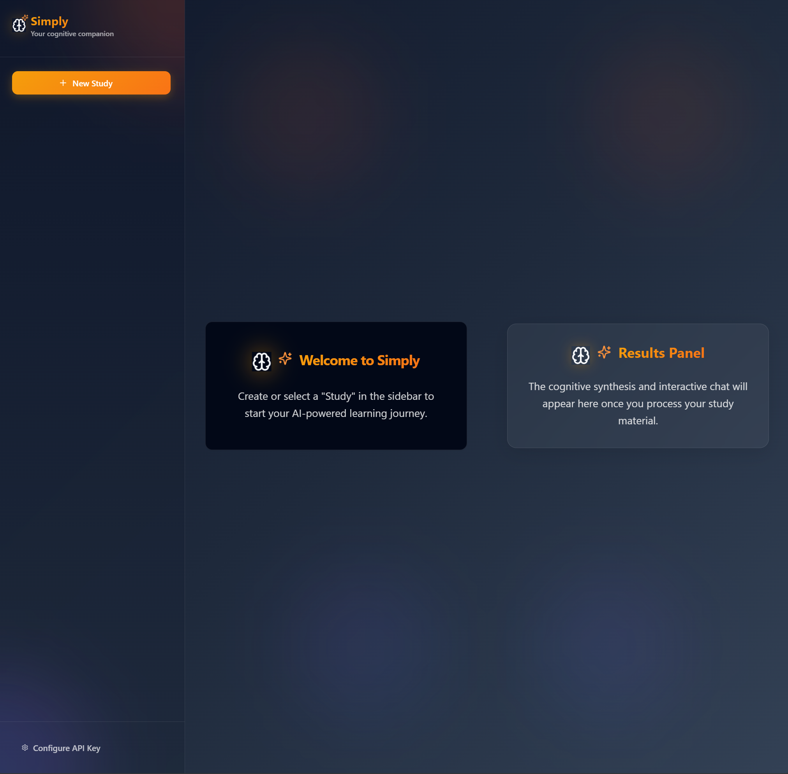
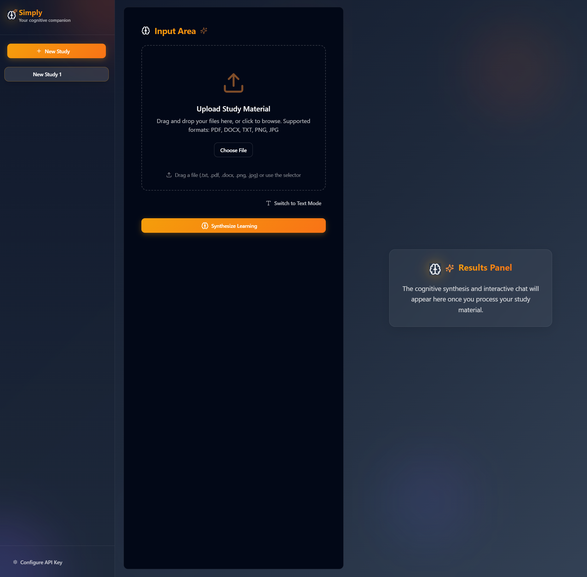
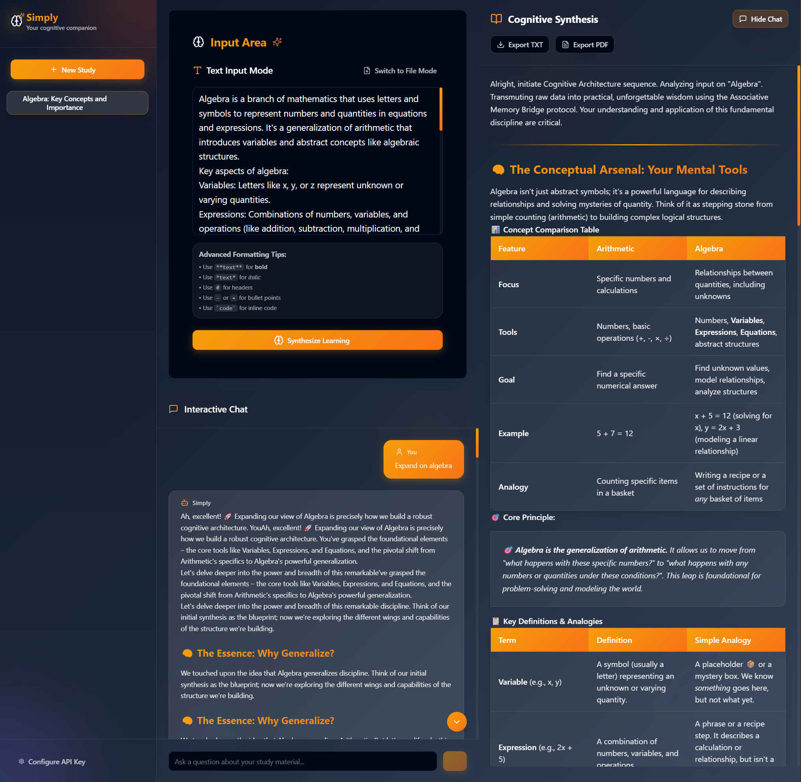

# 🧠 Simply - AI-Powered Personal Learning Agent

<div align="center">
  
</div>

<div align="center">

[](https://reactjs.org/)
[](https://www.typescriptlang.org/)
[](https://tailwindcss.com/)
[](https://ai.google.dev/)

**Transform your study materials into interactive learning experiences with AI**

[Features](#-features) • [Quick Start](#-quick-start) • [Usage Guide](#-usage-guide) • [API Setup](#-api-setup) • [Tech Stack](#-tech-stack)

</div>

---

## ✨ Features

### 🎯 **Smart Content Processing**

- **Multi-format Support**: Upload PDFs, DOCX, TXT files, and images
- **Text Input Mode**: Direct text entry with advanced formatting support
- **Auto-Title Generation**: AI automatically generates descriptive study titles
- **Content Synthesis**: Transform raw materials into structured learning content

### 💬 **Interactive AI Chat**

- **Context-Aware Conversations**: Chat with AI about your study materials
- **Real-time Streaming**: Watch responses generate in real-time
- **Smooth Auto-scroll**: Automatic scrolling during bot responses
- **Persistent Chat History**: All conversations saved locally

### 🎨 **Modern UI/UX**

- **Glassmorphism Design**: Beautiful glass-like interface effects
- **Responsive Layout**: Works seamlessly on desktop and tablet
- **Dark Theme**: Easy on the eyes for extended study sessions
- **Smooth Animations**: Polished micro-interactions throughout

### 📚 **Study Management**

- **Multiple Studies**: Create and manage multiple learning projects
- **Local Storage**: All data stored securely in your browser
- **Export Ready**: Easy to backup and share your studies
- **Smart Organization**: Auto-generated titles and timestamps

---

## 🚀 Quick Start

### Prerequisites

- **Node.js** (v16 or higher)
- **Google Gemini API Key** ([Get one here](https://aistudio.google.com/app/apikey))

### Installation

1. **Clone the repository**

   ```bash
   git clone https://github.com/yourusername/simply.git
   cd simply
   ```

2. **Install dependencies**

   ```bash
   npm install
   ```

3. **Set up your API key**

   ```bash
   # Create .env.local file
   echo "VITE_GEMINI_API_KEY=your_api_key_here" > .env.local
   ```

4. **Start the development server**

   ```bash
   npm run dev
   ```

5. **Open your browser**
   Navigate to `http://localhost:5173`

---

## 📖 Usage Guide

### Creating Your First Study

1. **Start Simply**

   - Open the app and you'll see the welcome screen
   - Click "New Study" in the sidebar to create your first project

2. **Add Study Material**

   - **File Upload**: Drag & drop PDFs, DOCX, TXT, or images
   - **Text Input**: Switch to text mode for direct content entry
   - **Paste Support**: Paste text or images directly from clipboard

3. **Generate Synthesis**

   - Click "Synthesize Learning" to process your content
   - AI will analyze and create structured learning material
   - Study title will be auto-generated based on content

4. **Start Learning**
   - Toggle the chat panel to interact with your content
   - Ask questions, request explanations, or explore topics
   - All conversations are saved for future reference

### Advanced Features

#### 📝 **Text Input Mode**

- **Markdown Support**: Use `**bold**`, `*italic*`, `# headers`
- **Code Blocks**: Wrap code in backticks for syntax highlighting
- **Lists**: Create bullet points with `-` or `•`
- **Real-time Saving**: Content is automatically saved as you type

#### 💬 **Interactive Chat**

- **Context-Aware**: AI understands your study materials
- **Streaming Responses**: Watch responses generate in real-time
- **Scroll Controls**: Auto-scroll with manual override option
- **Message History**: All conversations persist between sessions

#### 🎨 **Customization**

- **Study Titles**: Auto-generated or manually editable
- **Multiple Studies**: Organize different subjects or topics
- **Local Storage**: All data stored in your browser
- **Export Options**: Easy backup and sharing capabilities

---

## 🔧 API Setup

### Google Gemini API

1. **Get API Key**

   - Visit [Google AI Studio](https://aistudio.google.com/app/apikey)
   - Create a new API key for Gemini
   - Copy the key to your clipboard

2. **Configure Environment**

   ```bash
   # Create .env.local file in project root
   VITE_GEMINI_API_KEY=your_actual_api_key_here
   ```

3. **Security Notes**
   - Never commit your API key to version control
   - The `.env.local` file is already in `.gitignore`
   - API keys are stored locally in your browser

### API Usage Limits

- **Free Tier**: 15 requests per minute
- **Paid Tier**: Higher limits available
- **Content Limits**: Up to 1M tokens per request
- **File Size**: Up to 20MB per file

---

## 🛠️ Tech Stack

### Frontend

- **React 18** - Modern UI framework
- **TypeScript** - Type-safe development
- **Tailwind CSS** - Utility-first styling
- **shadcn/ui** - Beautiful component library
- **Vite** - Fast build tool and dev server

### AI & Processing

- **Google Gemini 2.5 Flash** - Advanced AI model
- **React Markdown** - Rich text rendering
- **File Processing** - Multi-format document handling

### Storage & State

- **LocalStorage** - Client-side data persistence
- **React Context** - Global state management
- **Custom Hooks** - Reusable logic

### Development Tools

- **ESLint** - Code quality
- **Prettier** - Code formatting
- **TypeScript** - Static type checking

---

## 📱 Screenshots

<div align="center">
  
  
</div>

---

## 🚀 Deployment

### Vercel (Recommended)

1. **Connect Repository**

   ```bash
   # Install Vercel CLI
   npm i -g vercel

   # Deploy
   vercel
   ```

2. **Set Environment Variables**
   - Add `VITE_GEMINI_API_KEY` in Vercel dashboard
   - Redeploy to apply changes

### Netlify

1. **Build Command**: `npm run build`
2. **Publish Directory**: `dist`
3. **Environment Variables**: Add `VITE_GEMINI_API_KEY`

### Manual Deployment

```bash
# Build for production
npm run build

# Serve the dist folder
npm run preview
```

---

## 🤝 Contributing

We welcome contributions! Here's how to get started:

1. **Fork the repository**
2. **Create a feature branch**: `git checkout -b feature/amazing-feature`
3. **Make your changes**
4. **Test thoroughly**
5. **Commit your changes**: `git commit -m 'Add amazing feature'`
6. **Push to branch**: `git push origin feature/amazing-feature`
7. **Open a Pull Request**

### Development Guidelines

- Follow TypeScript best practices
- Use Tailwind CSS for styling
- Maintain responsive design
- Add proper error handling
- Include TypeScript types

---

## 📄 License

This project is licensed under the MIT License - see the [LICENSE](LICENSE) file for details.

---

## 🙏 Acknowledgments

- **Google Gemini** for powerful AI capabilities
- **shadcn/ui** for beautiful components
- **Tailwind CSS** for utility-first styling
- **Vite** for fast development experience

---

## 📞 Support

- **Issues**: [GitHub Issues](https://github.com/yourusername/simply/issues)
- **Discussions**: [GitHub Discussions](https://github.com/yourusername/simply/discussions)
- **Email**: your.email@example.com

---

<div align="center">

**Made with ❤️ for learners everywhere**

[Star on GitHub](https://github.com/yourusername/simply) • [Report Bug](https://github.com/yourusername/simply/issues) • [Request Feature](https://github.com/yourusername/simply/issues)

</div>
